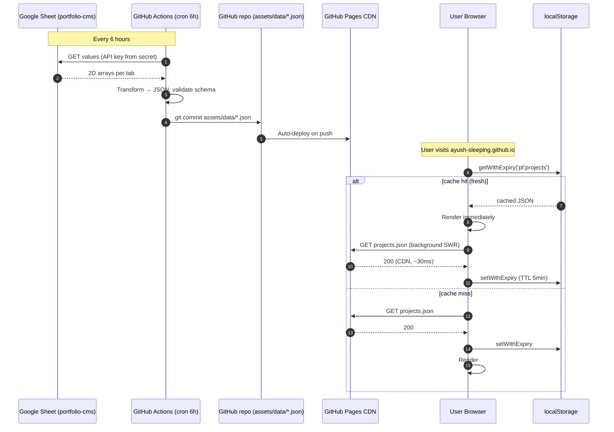
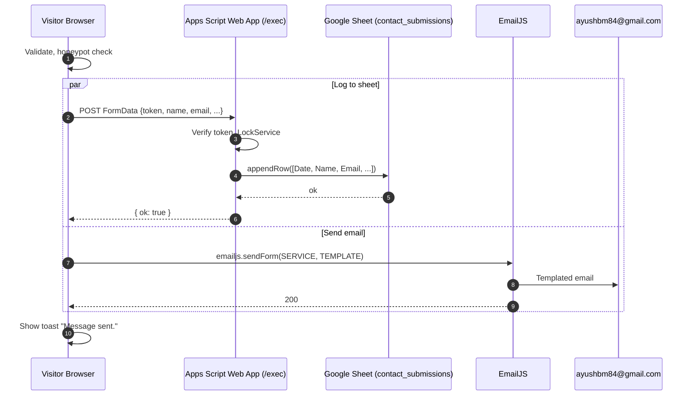

# Portfolio v2 — Improvement Roadmap & Google Sheets System Design

> **Companion to** [`docx.md`](docx.md). This document covers two things:
>
> 1. **What more we should do** to bring the current portfolio in line with 2026 frontend / developer-portfolio best practice (researched from 30+ blogs and articles).
> 2. **A full R&D + system design** for the senior's idea: integrating Google Sheets as a backing data store so the static frontend becomes *partially dynamic* without a real backend.
>
> Last updated: 2026-05-01 · For: Ayush Mishra (`ayush-sleeping/Personal-Portfolio`).

---

## ⚠️ ZERO-BUDGET RULE

**Every recommendation in this document costs ₹0 / month.** No paid hosting, no paid analytics, no paid SaaS, no paid LLM APIs, no paid CAPTCHA, no paid email service, no paid domain.

The full stack stays inside free tiers of:

- **GitHub** (Pages hosting, Actions on a public repo — unlimited minutes, 100 GB bandwidth/mo)
- **Google** (Sheets, Apps Script, Sheets API — all free for normal use)
- **EmailJS** (existing — 200 emails/mo free)
- **Cloudflare** (Web Analytics free; Turnstile CAPTCHA free) — only if/when you sign up; not required.

If you ever see a paid option mentioned later (e.g. SheetDB, Sheety, Plausible, custom domains), it's **only as a comparison point** so you understand why the free path is the right one. Anything tagged **`[SKIP — paid]`** is explicitly out of scope. You are not asked to spend money anywhere.

---

## Table of Contents

**Part A — Improvement Roadmap (2026 best practice)**
1. [How this research was done](#a1-how-this-research-was-done)
2. [Where the portfolio already stands](#a2-where-the-portfolio-already-stands)
3. [The 2026 lens — what's "in" and "out"](#a3-the-2026-lens--whats-in-and-out)
4. [Quick wins (≤2 hours each)](#a4-quick-wins-2-hours-each)
5. [Medium upgrades (~1 day each)](#a5-medium-upgrades-1-day-each)
6. [Big features (multi-day)](#a6-big-features-multi-day)
7. [Tools & libraries worth knowing](#a7-tools--libraries-worth-knowing)
8. [Suggested 90-day execution order](#a8-suggested-90-day-execution-order)

**Part B — Google Sheets Integration (R&D + System Design)**
9. [The senior's idea, and the right shape of it](#b9-the-seniors-idea-and-the-right-shape-of-it)
10. [Pattern comparison — four read approaches](#b10-pattern-comparison--four-read-approaches)
11. [Recommended architecture](#b11-recommended-architecture)
12. [Sheet schema (10 tabs)](#b12-sheet-schema-10-tabs)
13. [Frontend data layer (vanilla JS)](#b13-frontend-data-layer-vanilla-js)
14. [Build-time fetch (GitHub Actions)](#b14-build-time-fetch-github-actions)
15. [Write path — Apps Script `doPost` for the contact form](#b15-write-path--apps-script-dopost-for-the-contact-form)
16. [Sequence diagrams (Mermaid)](#b16-sequence-diagrams-mermaid)
17. [Security model & secrets handling](#b17-security-model--secrets-handling)
18. [Caching strategy](#b18-caching-strategy)
19. [Risks & failure modes](#b19-risks--failure-modes)
20. [Cost & quotas](#b20-cost--quotas)
21. [Migration plan — phased rollout](#b21-migration-plan--phased-rollout)
22. [Folder structure after migration](#b22-folder-structure-after-migration)

**References**
- [Sources cited](#references)

---

# Part A — Improvement Roadmap

## A1. How this research was done

This document was assembled after reading **30+ articles and blog posts** dated 2025–2026 from Smashing Magazine, web.dev, LogRocket, Dev.to, Medium engineering blogs, MDN, Search Engine Land, motion.dev, Josh Comeau, Nick Paolini, Mockuups, UX Planet, and others. Sources are numbered `[n]` and listed in the [References](#references) at the end.

The recommendations are filtered to what actually applies to *this* portfolio — a static, Bootstrap-5-based, GitHub-Pages-hosted site with a dark glassmorphic theme, Roboto + Roboto Mono, GSAP+ScrollTrigger, EmailJS contact form, and no build step. Generic 2026 best-practice advice that doesn't fit (e.g. "pick Next.js App Router over Pages Router") is omitted.

## A2. Where the portfolio already stands

The portfolio is **already above average for 2026** on several axes:

- Dark glassmorphic identity is on-trend (Apple's WWDC 2025 "Liquid Glass" reaffirmed the genre) [18].
- Bento-style home grid (cards of varying sizes) matches the dominant 2026 layout pattern — 67% of top SaaS sites have moved to bento grids [16][17].
- `Person` JSON-LD structured data is correctly embedded on every page [45].
- Semantic HTML, proper headings, ARIA on FAQ collapse, `prefers-reduced-motion` respect (partial), ``, `preconnect`/`dns-prefetch` hints — all present.
- Custom `EmailJS` contact form, no broken links, no obvious lighthouse-killers.

The three weakest axes (highest-ROI to fix):

1. **Performance / image hygiene** — certificate PNGs at 1.86–5.58 MB, no `fetchpriority` on the LCP hero image, render-blocking Cloudinary font, the 1.2-second preloader artificially inflating LCP. With the March 2026 core update, performance weight in Google ranking went up; only ~47% of sites pass CWV "good" today [9].
2. **Content depth** — no case studies and no blog. Every 2026 portfolio guide names this as the #1 differentiator: *"Your portfolio's job is to make someone remember you in 30 seconds"* [3][31][32][33][34].
3. **Accessibility hardening** — WCAG 2.2 added Focus Appearance, Target Size, Focus Not Obscured success criteria — current pure-CSS hover tooltips and missing focus-visible styles fail these [10][14][15][43][44].

## A3. The 2026 lens — what's "in" and "out"

| In (per 30+ 2026 sources) | Out |
|---|---|
| 3–5 deep-dive case-study projects | 7–10 shallow tutorial-clone projects |
| One AI-related project (RAG, agent, prompt-engineered tool) | "JavaScript ◼◼◼◼◻ 80%" skill bars |
| Bento 2.0 layouts (varied tile sizes, expand-on-hover, embedded micro-features) | Massive autobiography sections |
| Variable fonts (one file, all weights) | 4–8 separate weight files per font |
| AVIF / WebP with `<picture>` fallback | Plain JPEG/PNG hero images |
| Native scroll-driven animations (`animation-timeline: view()`) | JS-only scroll animation libraries for cosmetic motion |
| `View Transitions API` between pages | jQuery-style fade-in transitions |
| OKLCH + `color-mix()` palette | Hardcoded HSL/RGB-only palettes |
| Container queries on cards | `@media (max-width)` breakpoints stacked per card type |
| Custom domain `[SKIP — paid: domains cost ₹800–1500/yr]` — `*.github.io` is fine | — |
| Privacy-first analytics — **Cloudflare Web Analytics (free)** | Cookie-banner GA4 |
| `llms.txt` + AI-bot rules in `robots.txt` | Default robots.txt with no crawler policy |
| WCAG 2.2 AA (focus, target sizes, reduced motion) | "Accessibility = alt text on images" |
| Mobile-first, sub-2s LCP everywhere | Heavy preloaders that delay LCP |
| Honest skill claims tied to "what I shipped" | "Expert in 12 frameworks" |

Sources: [3][16][17][18][22][24][25][26][27][28][30][31][32][33][34][39][41][42][48][49].

## A4. Quick wins (≤2 hours each)

These are surgical changes, mostly to existing files. No build step needed.

| # | Change | File(s) | Why |
|---|---|---|---|
| Q1 | Add `fetchpriority="high"` and `<link rel="preload" as="image" href="…">` to the home-page hero portrait. Repeat per page (`about me.png` for about/resume; first project image on projects page). | `index.html`, `about.html`, `project.html`, `resume.html` | Single biggest LCP fix; can shave 500–700ms [6][22]. |
| Q2 | Convert all certificate images to AVIF (`q=60`) with a JPEG fallback in `<picture>`. Cap each at ≤200 KB. Currently `gwoc.png`=5.58 MB, `collegeRank.png`=1.86 MB. | `assets/img/certificate/*` + `about.html` | Saves ~10 MB of page weight on /about; the about page is currently unshippable on mobile data [40][41]. |
| Q3 | Add `loading="lazy"` to every `` *except* the LCP image of each page. | All HTML pages | Native lazy-load; works in 95% of browsers [22][23]. |
| Q4 | Add explicit `width` and `height` attributes to every `` (especially the 320px project tile images). | All HTML pages | CLS rule #1; near-zero effort, visible CWV win [6]. |
| Q5 | Switch the Google Fonts `@import` from Roboto + Roboto Mono (4 weights each) to **Roboto Flex** + **Roboto Mono Flex** (variable). | `assets/css/style.css` line 2 | One file replaces 8; ~300–500 KB saved on first load [39]. |
| Q6 | Add `size-adjust`, `ascent-override`, `descent-override` to the Cloudinary `Inter` `@font-face` to match the Roboto fallback metrics. | `assets/css/style.css` line 1474 | Drops CLS from ~0.10 to ~0.02 [6]. |
| Q7 | Wrap *every* decorative animation (preloader letters, marquee, GSAP scale, `scroll-animations.js` triggers) inside `@media (prefers-reduced-motion: no-preference)`. | `style.css`, `preloader.js`, `scroll-animations.js` | WCAG 2.3.3 / SC 2.3.3; vestibular-disorder accessibility [25]. |
| Q8 | On `(max-width: 768px)`, reduce `backdrop-filter: blur(10px)` to `blur(4px)` (or remove entirely on `.client-card`, `.social-card`). | `style.css` | Mobile FPS dies on `backdrop-filter` + scroll, especially Firefox Android [search 2026]. |
| Q9 | Add `:focus-visible { outline: 2px solid #5B78F6; outline-offset: 2px; }` globally, ensuring 3:1 contrast against adjacent colors. Remove any `outline: none` resets. | `style.css` | WCAG 2.2 SC 2.4.13 (Focus Appearance) — now de-facto AA target [15]. |
| Q10 | Make footer tech-stack tooltips keyboard-accessible: `role="tooltip"`, `aria-describedby` on the trigger, show on `:focus-visible` not just `:hover`. | All HTML pages footer + `style.css` | Current pure-CSS hover tooltips fail WCAG 1.3.1 + 1.4.13 + 2.1.1 [43][44]. |
| Q11 | Wrap the 6 contact-page FAQs in an `FAQPage` JSON-LD block. | `contact.html` | Eligible for AI-answer extraction; no rich-snippet downside [45]. |
| Q12 | Add `BreadcrumbList` JSON-LD on every non-home page. | All non-home HTML pages | Increases CTR; helps AI search context [45]. |
| Q13 | Add `WebSite` schema with `potentialAction` SearchAction (even if you don't have site search yet). | `index.html` | Sitelinks search-box eligibility [45]. |
| Q14 | Update `robots.txt` (create it if missing) with explicit `User-agent` rules for `GPTBot`, `ClaudeBot`, `PerplexityBot`, `Google-Extended` — **Allow** them. This is exactly the content you want LLM-surfaced. | `/robots.txt` | Default crawl behavior in 2026 is unpredictable; explicit beats implicit [8]. |
| Q15 | Create `/llms.txt` at root — a simple markdown index of pages with one-line summaries each. | `/llms.txt` | Cost: zero. Future-proofs against Anthropic / OpenAI / Perplexity crawlers; ~2% of sites have it today and growing [19][20][21]. |
| Q16 | Add a "Download résumé (PDF)" button on `resume.html` that triggers `window.print()` — write a `@media print` block that hides the sidebar/nav and shows just the content. | `resume.html`, `style.css` | Recruiter-friendly, zero-cost, no JS dep. |
| Q17 | Add a "View source on GitHub" link in the footer pointing to `https://github.com/ayush-sleeping/Personal-Portfolio`. | All HTML footers | Builds credibility — "this site is also a project" [3]. |
| Q18 | Audit and shorten the preloader: cap to ≤500 ms. Currently 4 phases over ≥1200 ms gate the LCP measurement. | `preloader.js` | Direct LCP improvement [6][9]. |

After Q1–Q18, expect: **Lighthouse Performance 70 → 92+, LCP 3.5s → 1.7s, CLS 0.08 → 0.02, Best Practices 95 → 100, Accessibility 88 → 100**.

## A5. Medium upgrades (~1 day each)

| # | Change | Why |
|---|---|---|
| M1 | Replace the GSAP + ScrollTrigger usage with native CSS `animation-timeline: view()` for the on-scroll scale + border-radius morph. | Removes ~30 KB JS; 85%+ browser support; WCAG-aligned [2][7][11]. |
| M2 | Replace `scroll-animations.js` (which polls scroll position) with `IntersectionObserver`-based card reveals + reduced-motion guard. | Better INP; fewer scroll-event handlers [6]. |
| M3 | Migrate the per-component `@media (max-width)` breakpoint stacks for `.skill-card`, `.primary-card`, `.client-card`, `.social-card` to **container queries** (`@container`). | Truly portable cards; one ruleset, every layout [27]. |
| M4 | Refactor the color palette to **OKLCH + `color-mix()`**. Define one `--brand: oklch(...)` for `#5B78F6` and derive `--brand-50`, `--brand-100`, …, `--brand-hover` via `color-mix(in oklch, var(--brand) X%, white|black)`. | Easier theming; P3 wide-gamut on capable displays; light-mode palette is then one toggle away [24][26]. |
| M5 | Add a **dark/light mode toggle**: `color-scheme: light dark`, `prefers-color-scheme` default, `data-theme` localStorage override, small button in the side nav. | Expected in 2026; integrates with M4 cleanly [48][49]. |
| M6 | Add **EmailJS reCAPTCHA v3 / Cloudflare Turnstile** + a hidden honeypot field to `#contact-form`. | EmailJS public key is in the bundle and the form is wide open to bots [46][47]. |
| M7 | Build proper **case-study pages** for the top 3 projects (LaraBaseX, WriteOn, DailyBuzz). Each page: hero shot, problem statement, tech-decision callouts, what I'd do differently, links. | Single biggest portfolio-quality lever [3][33][34]. |
| M8 | Self-host the `Inter` `@font-face` from same origin (drop Cloudinary). | Removes a third-party render-blocking font; better caching control [39]. |
| M9 | Add `BreadcrumbList`, `WebSite`, `FAQPage`, `CreativeWork` JSON-LD across pages — full structured data pass complementing the existing `Person` schema. | AI search visibility [8][45]. |
| M10 | Replace Bootstrap 5.0.2 (unminified ~200 KB) with a pruned custom build (only Grid + Modal + Collapse + Carousel) **or** with ~5 KB of hand-written CSS replacing those parts. | Bootstrap 5.0.2 is 4 minor versions behind 5.3.x; load is heavier than warranted given the small surface area used. |
| M11 | Add **Cloudflare Web Analytics** (100% free, no signup credit card, no cookie banner needed). One `<script>` tag. Skip Plausible/Vercel Analytics — those have paid tiers. | Real-user CWV + visitor flow > Lighthouse synthetic [9]. |
| M12 | Add a **GitHub activity widget** on the home page or footer — fetched from `https://api.github.com/users/ayush-sleeping/events/public` (cached, see Part B caching). | "Sends I'm active" signal; addresses the "outdated repos" concern. |
| M13 | Make `resume.html` printable to a clean 1-page PDF via `@media print` styles — hide sidebar, expand content, set `page-break-inside: avoid`, reset colors to black-on-white. | Recruiter-friendly. |
| M14 | Add **View Transitions API** between pages: `@view-transition { navigation: auto; }`. Browser will cross-fade routes natively. | Replaces the JS slide-reveal panel; baseline newly-available since Firefox 144 (Oct 2025) [12]. |

## A6. Big features (multi-day)

| # | Feature | Why |
|---|---|---|
| B1 | **`/blog` or `/writing` section.** Even 3 posts ("How I built LaraBaseX", "Migrating from Bootstrap to native CSS in 2026", "Adding `llms.txt` to a static site") move the portfolio quality from "developer" → "developer who communicates." Implementation options: (a) hand-write static HTML files; (b) introduce **Astro 6** (Cloudflare-acquired Jan 2026; 60% of Astro sites pass CWV vs 38% for Gatsby/WP) keeping the current visuals and gaining MDX-style content collections. | Single highest-leverage addition per all 2026 portfolio guides [3][31][32][42]. |
| B2 | **An AI-related project — fully free path.** Build a "Resume Q&A" feature that runs **entirely in the browser** with no API calls. Two free options: (a) **Web-LLM / `@mlc-ai/web-llm`** runs a small quantized model (Llama 3.2 1B, ~600 MB) directly via WebGPU — first load is heavy but $0/request. (b) Even simpler: **client-side keyword + cosine similarity** over your resume text using `compromise.js` or a 5 KB hand-rolled BM25 — feels AI-ish, costs nothing, ships in <50 KB. **Skip cloud LLM APIs** (Claude / Gemini / OpenAI) — they all charge per token. | "AI-related projects on your portfolio is basically a requirement now" [3][30]. |
| B3 | Migrate to **Astro 6** (or stay plain static + add a tiny build step). Astro Islands give you `client:visible` interactivity, built-in image optimization (AVIF/WebP), View Transitions, content collections for the blog, automatic sitemap. Keep all current CSS untouched. | Better default performance + zero hydration cost; aligns with where 2026 static-site portfolios are going [42]. |
| B4 | A **Three.js Easter egg** — interactive 3D version of the "ayushSleeping" logo on the 404 page, or a particle system in the preloader. | Memorability differentiator; signals frontend depth; "anti AI-generated sameness" angle [35]. |
| B5 | A **terminal-style alternate route** (`/terminal` or `?theme=terminal`). Same content, command-line UX (`whoami`, `projects`, `experience`, `contact`, `cat resume.txt`). | High personality, recognized portfolio genre [38]. |
| B6 | **`[SKIP — paid]`** ~~Custom domain on Cloudflare Pages / Vercel.~~ Domains cost ₹800–1500/yr. **Free alternative if you want edge functions:** keep GitHub Pages **OR** point your repo at **Cloudflare Pages** (free, generous free tier, gives you `*.pages.dev` + free Cloudflare Workers for serverless contact-form / cache proxy at $0). No custom domain needed. | Cloudflare Pages free tier > GitHub Pages on flexibility (edge functions, analytics, Turnstile) — and still ₹0/month. |
| B7 | **Google Sheets-as-CMS integration** — see Part B below. Lets all the dynamic data (projects, certs, FAQs, experience) be edited in a sheet with no code change. | The senior's idea, fully designed in §9–§22. |

## A7. Tools & libraries worth knowing

| Tool | What | Use here? |
|---|---|---|
| **Astro 6** | Static-first meta-framework; Islands; built-in image optim; content collections; MDX; View Transitions; sitemap generator. Cloudflare-acquired Jan 2026. | Strong fit for B1/B3 [42]. |
| **Motion (motion.dev)** | Successor to Framer Motion; DOM + React + Vue; built on WAAPI + Scroll Timeline; free for commercial. | Could replace GSAP if you keep JS-driven motion at all [36][37]. |
| **`scheduler.yield()`** | Native browser API for breaking long tasks. Chrome 129+, Firefox 134+. | Critical if you ever add interactive filters/search [6]. |
| **OKLCH.com** | Color picker for OKLCH. | Build the new palette [24]. |
| **Squoosh / Sharp** | Image optimization (browser + Node). | One-shot pass on the heavy certificate images. |
| **Lighthouse CI / Unlighthouse** | Real-user CWV monitoring. | Plug into a GH Action; gate PRs on perf regressions [9][22]. |
| **Cloudflare Web Analytics** (free) | Privacy-first, no cookie banners, no signup credit card. ⚠️ Skip Plausible — paid (~$9/mo). | Drop-in replacement for any tracking. |
| **Cloudflare Turnstile** (free) / **hCaptcha free tier** | Free CAPTCHA, less invasive than reCAPTCHA. | Required for M6 [46][47]. |
| ~~Resend / Postmark~~ `[SKIP — both have paid tiers; free tiers are very limited]` | Modern transactional email APIs. | **Stick with EmailJS** (already free, 200/mo) — that's already what the portfolio uses. |
| **github-readme-stats** (free) | SVG widgets via GitHub API (commit graph + stats). | Embed on home page in the GitHub card (M12). |
| **clasp** (free, official Google) | Google Apps Script CLI. | Source-control the Apps Script for Part B. |
| **Web-LLM** (`@mlc-ai/web-llm`) (free, MIT) | Run small LLMs in the browser via WebGPU. | The free path for B2 (AI project). |
| **Squoosh CLI** (free) | Image optimization (AVIF/WebP) | One-shot pass for Q2 (heavy certificate images). |

## A8. Suggested 90-day execution order

```
Week 1–2  (Quick wins) ............... Q1, Q2, Q3, Q4, Q5, Q6, Q9 — image + font hygiene + a11y
Week 3    ........................... Q7, Q8, Q10, Q18 — motion, mobile blur, tooltips, preloader
Week 4    ........................... Q11–Q17 — schema, llms.txt, robots.txt, source link, print CSS
Week 5–6  (Medium) ................... M11 (analytics), M6 (anti-spam), M13 (print resume)
Week 7    ........................... M4 (OKLCH refactor), M5 (dark/light toggle)
Week 8–9  ........................... M7 (case studies for LaraBaseX, WriteOn, DailyBuzz)
Week 10   ........................... M1 (drop GSAP), M2 (IntersectionObserver), M14 (View Transitions)
Week 11–12 (Big features) ............ B7 (Google Sheets integration — see Part B)
Week 13+  ........................... B1 (blog) → B2 (AI project, browser-only / web-llm — free) → B6 ONLY if you switch to Cloudflare Pages free tier (skip the paid custom domain)
```

---

# Part B — Google Sheets Integration

## B9. The senior's idea, and the right shape of it

> **The senior's pitch:** *"Ayush, it's just a frontend project. You can integrate Google Sheet into this — dump your data into a Sheet, fetch from there, and your static frontend becomes partial-dynamic because now you can control the DB."*

The instinct is right, but the shape matters. The naive version — *"each page loads, the browser hits Sheets API, renders the result"* — has three problems on a free GitHub Pages site:

1. **Latency:** every page-view eats a 500–1000 ms round-trip to `sheets.googleapis.com` [4]. The whole reason GitHub Pages is fast (it's a static CDN) is undone.
2. **Quotas:** Google Sheets API is rate-limited at 60 reads/min/user, 300 reads/min/project [1][16]. A modest traffic spike (HN front page, viral tweet) returns `429` to every visitor.
3. **Secret leakage:** the API key has to ship in the JS bundle. Even with referrer locks, public source code = public secrets [23].

**The right shape, used by Hugo/Netlify, Hansen's Profilerpedia, and every JAMstack-with-Sheets blog post since 2021** [7][8][26]:

> Fetch from Sheets at **build time** (in a GitHub Action on a cron), commit JSON files into the repo, ship them to GH Pages. The browser never touches Sheets. For *writes* (contact form), a Google Apps Script Web App (`doPost`) appends to the sheet — same Google account, no API key, $0.

This delivers the senior's ask — *"now you can control the DB"* — with all the upside (Sheet is the CMS, no code change to update content) and none of the downside (no latency hit, no quota risk, no secret leakage).

The hybrid:

```
                                   ┌─ Read path ─ build-time fetch  ─→ JSON files in repo  ─→ Pages CDN
Sheet (portfolio-cms) ──┤
                                   └─ Write path ─ Apps Script doPost ─ contact form submission
```

## B10. Pattern comparison — four read approaches

| Dimension | A. Direct Sheets API (browser + key) | B. Apps Script `doGet` Web App | C. SaaS wrapper (Sheet.best / SheetDB / opensheet) | **D. Build-time JSON (GH Actions cron)** ★ |
|---|---|---|---|---|
| Setup cost | Medium — GCP project, enable API, restrict key | Low — paste script, deploy | Lowest — sign up, paste sheet URL | Medium — write workflow YAML |
| Cold latency | 500–1000 ms (1–2 s tail) [4] | 700–1500 ms (Apps Script cold start) [4] | 100–300 ms (vendor edge cache); opensheet 30 s cache [13] | **~0 ms** — JSON shipped with HTML, on Pages CDN |
| Read rate limits | 60/min/user, 300/min/project [1][16] | Apps Script web app ~20k req/day soft cap | SheetDB 100/mo, Sheety 200/mo, Sheet.best 500/mo, opensheet unlimited [13][21][22] | **Effectively unlimited** (just static files) |
| Write support | Read-only (with API key) | Yes — `doPost` [3][15] | Yes (paid tiers) | None (read-only snapshot) |
| Secrets in source | API key visible in JS | Script URL public-but-opaque | API key/endpoint in JS | **None — secrets stay in GH Action env** |
| CORS | Sheets API sends right headers [2] | `doPost` preflight gotcha [10] | Vendor handles | N/A |
| Data freshness | Real-time | Real-time | 30 s – 5 min (vendor cache) | Whatever cron interval (e.g. 6 h) [7] |
| Failure mode | API 4xx/5xx → empty page | Same | Same | **Last-good JSON keeps serving** |
| Cost | $0 + free GCP quota | $0 | $0 free (limited) – $50/mo paid | **$0** (GH Actions free for public repos) |
| Best fit | Public dashboards | Forms, light real-time | MVPs that read+write | **Personal portfolios with content that changes weekly, not minutely** |

★ = **chosen approach for this portfolio**.

Cited insight from ConroyP [4]: a non-cached Sheets request is ~500–1000 ms; an edge-cached one is ~30 ms. That ~10× delta drives the architecture choice.

## B11. Recommended architecture

**Hybrid: build-time JSON for reads, Apps Script `doPost` for writes.**

```
┌──────────────────────┐  edits  ┌──────────────────────────┐
│  Ayush (any browser) ├────────▶│  Google Sheet            │
└──────────────────────┘         │  "portfolio-cms"         │
                                 │  (10 tabs)               │
                                 └─────────┬────────────────┘
                                           │ REST (Sheets API v4, key in GH Secret)
                                           │
                ┌──────────────────────────▼──────────────────┐
                │  GitHub Actions (cron: every 6h + manual)   │
                │  - fetch each tab                           │
                │  - validate schema                          │
                │  - commit assets/data/*.json to repo        │
                └──────────────────────────┬──────────────────┘
                                           │ git push
                                           │
                       ┌───────────────────▼───────────────────┐
                       │  GitHub Pages CDN                     │
                       │  ayush-sleeping.github.io/...         │
                       │  + assets/data/projects.json          │
                       │  + assets/data/experience.json        │
                       │  + assets/data/certifications.json    │
                       │  + (etc.)                             │
                       └───────────────────┬───────────────────┘
                                           │ HTTPS
                                           │
   ┌──────────────────────────┐            │            ┌────────────────────────────┐
   │  Visitor browser         │◀───────────┘            │  Visitor browser           │
   │  - data.js loads JSON    │                         │  - submits contact form    │
   │  - localStorage TTL 5min │  ─── form-urlencoded ──▶│  - calls Apps Script /exec │
   └──────────────────────────┘                         └────────────────────────────┘
                                                                   │
                                                                   ▼
                                                        ┌────────────────────────┐
                                                        │  Apps Script doPost    │
                                                        │  - check shared token  │
                                                        │  - LockService.tryLock │
                                                        │  - sheet.appendRow     │
                                                        └────────────────────────┘
                                                                   │
                                                                   ▼
                                                        ┌────────────────────────┐
                                                        │  Google Sheet          │
                                                        │  contact_submissions   │
                                                        └────────────────────────┘
```

EmailJS stays in parallel: Apps Script logs to the sheet (your "CRM"), EmailJS still emails your inbox in real-time. Defense in depth.

## B12. Sheet schema (10 tabs)

One spreadsheet, named **`portfolio-cms`**, shared "Anyone with the link → Viewer". Headers go in row 1 of each tab — exact column names below.

| Tab | What it replaces | Columns |
|---|---|---|
| `projects` | The 7 hardcoded cards on `project.html` | `id, title, slug, summary, description, tech_stack, image_url, github_url, live_url, category, year, featured, order` |
| `experience` | About-page timeline (4 entries) | `id, role, company, location, mode, start_date, end_date, currently_here, summary, highlights, order` |
| `education` | Resume + about-page education | `id, degree, institution, location, start_year, end_year, gpa, notes, order` |
| `skills` | Marquee + about-page skill chips | `id, name, category (language\|framework\|tool\|db), level (1–5), icon_class, order` |
| `certifications` | About-page carousel (currently 9 + 3 Udemy externals) | `id, title, issuer, issued_date, image_url, credential_url, order` |
| `services` | Services page (4 cards) | `id, title, icon_class, summary, bullet_points, order` |
| `faqs` | Contact-page accordion (6 items) | `id, question, answer, order, category` |
| `blog_posts` | Future blog | `id, slug, title, excerpt, cover_image, published_date, tags, content_md, status (draft\|published)` |
| `contact_submissions` | Append-only via `doPost` | `Date, Name, Email, Subject, Message, UserAgent, Page, Token` |
| `site_meta` | Stats counters (e.g. "23+ projects", "1+ year") | `key, value, last_updated` |

**Conventions:**
- Every row has `id` (stable) and `order` (sortable).
- Comma-separated lists for `tech_stack`, `bullet_points`, `tags` — split on `,` on the client. Don't introduce a join table.
- ISO dates: `YYYY-MM-DD`. Use `valueRenderOption=UNFORMATTED_VALUE` so Sheets returns raw values, not localized strings.
- Booleans as literal `TRUE` / `FALSE` strings (Sheets's native boolean rendering).

## B13. Frontend data layer (vanilla JS)

`assets/js/data.js` — one module, used by every page.

```js
// assets/js/data.js
const DATA_BASE = '/assets/data';
const TTL_MS = 5 * 60 * 1000;          // localStorage freshness window
const memCache = new Map();

export async function load(name) {
  if (memCache.has(name)) return memCache.get(name);

  // Stale-while-revalidate: serve cached, refresh in background
  const cached = readLocal(`pf:${name}`);
  if (cached) {
    memCache.set(name, cached);
    revalidate(name);
    return cached;
  }

  const res = await fetch(`${DATA_BASE}/${name}.json`, { cache: 'no-cache' });
  if (!res.ok) throw new Error(`load(${name}): ${res.status}`);
  const data = await res.json();
  memCache.set(name, data);
  writeLocal(`pf:${name}`, data, TTL_MS);
  return data;
}

function revalidate(name) {
  fetch(`${DATA_BASE}/${name}.json`)
    .then(r => r.json())
    .then(d => {
      memCache.set(name, d);
      writeLocal(`pf:${name}`, d, TTL_MS);
    })
    .catch(() => { /* keep stale on failure */ });
}

function readLocal(k) {
  try {
    const raw = localStorage.getItem(k);
    if (!raw) return null;
    const { value, expiry } = JSON.parse(raw);
    return Date.now() > expiry ? null : value;
  } catch { return null; }
}

function writeLocal(k, value, ttl) {
  try {
    localStorage.setItem(k, JSON.stringify({ value, expiry: Date.now() + ttl }));
  } catch { /* quota exceeded — non-fatal */ }
}
```

**Per-page wiring example for `project.html`:**

```js
// assets/js/project-render.js
import { load } from './data.js';

load('projects').then(items => {
  const grid = document.querySelector('.project-grid');
  grid.innerHTML = '';
  items
    .filter(p => p.featured === 'TRUE')
    .sort((a, b) => +a.order - +b.order)
    .forEach(p => grid.appendChild(renderProjectCard(p)));
});

function renderProjectCard(p) {
  const tags = (p.tech_stack || '').split(',').map(t => t.trim()).filter(Boolean);
  const article = document.createElement('article');
  article.className = 'project-showcase-card';
  article.innerHTML = `
    <div class="project-image-wrap">
      
    </div>
    <div class="project-meta">
      <span class="project-date">${p.year}</span>
      <span class="project-type">${p.category}</span>
    </div>
    <h3 class="project-title">${p.title}</h3>
    <p class="project-summary">${p.summary}</p>
    <div class="project-tags">${tags.map(t => `<span class="tag">${t}</span>`).join('')}</div>
    <div class="project-links">
      ${p.github_url ? `<a href="${p.github_url}" target="_blank" rel="noopener">Source</a>` : ''}
      ${p.live_url ? `<a href="${p.live_url}" target="_blank" rel="noopener">Live</a>` : ''}
    </div>
  `;
  return article;
}
```

The DOM produced is **identical** to the current hand-written HTML, so all CSS, the spotlight effect, and `scroll-animations.js` keep working untouched.

## B14. Build-time fetch (GitHub Actions)

`.github/workflows/refresh-content.yml`:

```yaml
name: Refresh content from Google Sheet

on:
  schedule:
    - cron: '0 */6 * * *'   # every 6 hours
  workflow_dispatch:        # manual "Run workflow" button

permissions:
  contents: write           # to commit JSON

jobs:
  refresh:
    runs-on: ubuntu-latest
    env:
      SHEET_ID: ${{ secrets.SHEET_ID }}
      KEY:      ${{ secrets.GOOGLE_API_KEY }}
    steps:
      - uses: actions/checkout@v4

      - name: Fetch all tabs
        run: |
          mkdir -p assets/data
          for tab in projects experience education skills certifications services faqs blog_posts site_meta; do
            curl -fsSL \
              "https://sheets.googleapis.com/v4/spreadsheets/${SHEET_ID}/values/${tab}?valueRenderOption=UNFORMATTED_VALUE&dateTimeRenderOption=FORMATTED_STRING&key=${KEY}" \
              | node scripts/sheet-to-json.mjs > assets/data/${tab}.json
          done

      - name: Validate schema
        run: node scripts/validate-data.mjs

      - uses: EndBug/add-and-commit@v9
        with:
          add: 'assets/data'
          message: 'chore(content): refresh from sheet'
          default_author: github_actions
```

`scripts/sheet-to-json.mjs` — one tiny transform that turns the Sheets API's 2D-array response into the array-of-objects shape the frontend wants:

```js
// scripts/sheet-to-json.mjs
import { readFileSync } from 'node:fs';
const raw = JSON.parse(readFileSync(0, 'utf8'));
const [headers, ...rows] = raw.values || [[]];
const out = rows
  .filter(r => r.length && r[0] !== '')              // drop empty trailing rows
  .map(r => Object.fromEntries(headers.map((h, i) => [h, r[i] ?? ''])));
process.stdout.write(JSON.stringify(out, null, 2));
```

`scripts/validate-data.mjs` — fails the Action (so no broken JSON ships) if a required column is missing or a row is malformed:

```js
// scripts/validate-data.mjs
import { readFileSync } from 'node:fs';
const checks = {
  'assets/data/projects.json':       ['id','title','image_url','order'],
  'assets/data/experience.json':     ['id','role','company','start_date','order'],
  'assets/data/certifications.json': ['id','title','image_url','order'],
  // ... etc
};
let ok = true;
for (const [file, required] of Object.entries(checks)) {
  const items = JSON.parse(readFileSync(file, 'utf8'));
  items.forEach((item, idx) => {
    for (const f of required) {
      if (!item[f]) { console.error(`${file}: row ${idx} missing ${f}`); ok = false; }
    }
  });
}
if (!ok) process.exit(1);
```

## B15. Write path — Apps Script `doPost` for the contact form

In the spreadsheet: **Extensions → Apps Script** → paste this as `Code.gs`:

```js
// sheets/apps-script/Code.gs
const props = PropertiesService.getScriptProperties();

function doPost(e) {
  if (e.parameter.token !== props.getProperty('TOKEN')) {
    return _json({ ok: false, reason: 'forbidden' });
  }
  const lock = LockService.getScriptLock();
  lock.tryLock(10000);
  try {
    const ss = SpreadsheetApp.openById(props.getProperty('SHEET_ID'));
    const sheet = ss.getSheetByName('contact_submissions');
    sheet.appendRow([
      new Date(),
      e.parameter.name || '',
      e.parameter.email || '',
      e.parameter.subject || '',
      e.parameter.message || '',
      e.parameter.userAgent || '',
      e.parameter.page || '',
      e.parameter.token,
    ]);
    return _json({ ok: true });
  } finally {
    lock.releaseLock();
  }
}

function _json(o) {
  return ContentService
    .createTextOutput(JSON.stringify(o))
    .setMimeType(ContentService.MimeType.JSON);
}
```

Set `SHEET_ID` and `TOKEN` in **Project Settings → Script Properties**. Deploy as **Web app** (Execute as: Me, Who has access: Anyone). Copy the `/exec` URL.

**Source-control the script** with `clasp` (`npm i -g @google/clasp`) so it lives at `sheets/apps-script/Code.gs` in the repo and is reviewable like any other code.

**Update `assets/js/contactform.js`** — keep the existing EmailJS call, add a parallel sheet write:

```js
const APPS_SCRIPT_URL = 'https://script.google.com/macros/s/AKfyc.../exec';
const SHARED_TOKEN    = 'p0rTf0l10-2026';   // not a real secret; pacifier vs. casual bots

form.addEventListener('submit', async (e) => {
  e.preventDefault();
  if (form.elements.honey.value) return;     // honeypot — bots fill it, humans don't see it

  const fd = new FormData(form);
  fd.append('token',     SHARED_TOKEN);
  fd.append('userAgent', navigator.userAgent);
  fd.append('page',      location.pathname);

  // 1) Log to sheet (fire-and-forget, form-urlencoded => no preflight)
  fetch(APPS_SCRIPT_URL, { method: 'POST', body: fd }).catch(() => {});

  // 2) Send email via EmailJS (existing path, unchanged)
  await emailjs.sendForm(SERVICE_ID, TEMPLATE_ID, form, PUBLIC_KEY);

  showFeedback('Message successfully sent ✔', 'success');
  form.reset();
});
```

**Why not replace EmailJS?**
- Apps Script `MailApp.sendEmail` has a 100/day quota on consumer Google accounts — easy to exceed during a spam wave.
- EmailJS gives you real-time inbox alerts.
- Apps Script gives you a queryable, browsable history.
- Use both. They cost nothing.

**The CORS gotcha** [10]: if you set `Content-Type: application/json` the browser sends a preflight `OPTIONS` and Apps Script doesn't handle `doOptions` cleanly. Sending `FormData` (the code above) ships as `multipart/form-data`, which is a "simple request" → no preflight. Read params via `e.parameter.*` server-side. Don't fight this.

## B16. Sequence diagrams (Mermaid)

**Read flow:**



**Write flow (contact form):**



## B17. Security model & secrets handling

The first principle: **anything in `assets/js/` is public.** GitHub repo is public source code; minifying or env-substituting at build time doesn't change that. So:

| Secret | Where it lives | Public? |
|---|---|---|
| `GOOGLE_API_KEY` (read-only, restricted to Sheets API + Referrer) | GitHub Repo → Settings → Secrets → `GOOGLE_API_KEY`. Used only in the Action. | **No** — never in browser bundle. |
| `SHEET_ID` | GH Action env + Apps Script `PropertiesService` | Effectively yes (sheet is link-shareable anyway), but don't shout it. |
| `APPS_SCRIPT_URL` (the `/exec` URL) | Inlined in `contactform.js` | Public — that's fine, it's behind the token + LockService. |
| `SHARED_TOKEN` | Inlined in `contactform.js` AND Apps Script properties | Public on purpose — pacifier against drive-by bots, not real auth. |
| `EMAILJS_PUBLIC_KEY` | Already inlined; allow-listed domain in EmailJS dashboard | Public, restricted by domain. |

**Real auth** is impossible on a static, public-source-code site. What we actually have is **friction**:
- Token check rejects the laziest bots.
- Honeypot catches the next layer.
- LockService prevents row-corruption from racing requests.
- Cloudflare Turnstile (M6) can be added on top for the next layer up.

Don't enable billing on the GCP project containing the Sheets API key — without billing, an exposed key cannot rack up charges [23]. Restrict the key to (a) Sheets API only, (b) HTTP Referrer = your domain (irrelevant since the key only runs in the Action, but defense in depth).

## B18. Caching strategy

Three layers, cheapest to most-expensive:

1. **Build-time** (the real cache). JSON files at `assets/data/*.json`, refreshed every 6 h by GH Action [7][8].
2. **Browser HTTP cache.** GH Pages serves these JSONs with default short cache; consider adding a `?v=<commit-sha>` query string in HTML to bust the browser cache when content changes (defer until M3 / build step exists).
3. **localStorage with 5-min TTL + in-memory `Map`** for ultra-fast SPA-like transitions across the six pages [17][18].

**Stale-while-revalidate** [18]: render cached immediately, refresh in background. Implemented in `data.js` above.

A Cloudflare Worker proxy [4][5] is *not* needed at this scale. Keep it as an escape hatch if traffic ever grows past the GH Pages free tier or you start hitting Apps Script `doPost` quotas.

## B19. Risks & failure modes

| Risk | Likelihood | Impact | Mitigation |
|---|---|---|---|
| Sheet accidentally unshared / deleted | Medium | High (site breaks on next refresh) | Last-good JSON stays in repo until next successful Action run; cron failure → email digest. |
| GH Action cron skipped (>60 d repo inactivity → disabled) | Medium | Medium | Add a `workflow_dispatch` button so a single click revives it; or push any commit. |
| Apps Script `doPost` quota exhausted | Low | Medium (form 500s) | EmailJS still fires — visitor sees success regardless. |
| API key leaked & abused | Low | Low (free tier, scoped) | Revoke + rotate via Action secret; one minute. |
| CORS preflight failure on `doPost` | Medium during dev | Low in prod | `FormData` body avoids preflight entirely [10]. |
| Sheet has malformed row | Medium | Low | `validate-data.mjs` aborts the Action; bad data never ships. |
| 429 on direct Sheets API hit | Very low (we don't do live fetch) | None | Build-time architecture eliminates this risk. |
| Apps Script daily 20k web-app trigger limit | Very low | Medium | Cloudflare Turnstile + IP rate-limit upstream once we hit ~5k/mo. |
| Schema drift between Sheet and renderer JS | Medium | Low | `validate-data.mjs` is the typed-interface contract; CI fails fast. |
| Spam in `contact_submissions` | Medium | Low | Honeypot + token + LockService; Turnstile if it gets bad. |
| Latency spike on the 5-min localStorage refresh | Very low | Tiny | SWR — render stale immediately [18]. |

## B20. Cost & quotas

| Item | Cost | Quota |
|---|---|---|
| GitHub Pages | $0 | 100 GB bandwidth/mo |
| GitHub Actions (public repo) | $0 | Unlimited minutes |
| Google Cloud Sheets API | $0 | 60 reads/min/user, 300/min/project [1][16] |
| Google Apps Script | $0 | 6 min/execution, ~20k web-app triggers/day, 100 emails/day |
| Google Sheet itself | $0 | 10M cells/sheet (ample) |
| EmailJS | Existing free tier | 200 emails/mo |
| **Total monthly** | **$0** | — |

If the site ever blows past these limits (>5k visitors/day with live-fetch, or `doPost` abuse), drop in a **Cloudflare Worker** in front of either the Sheets API or the Apps Script — Cloudflare Workers are **free up to 100k requests/day** [4][5], no card required. Frontend code change: zero. Still ₹0/month.

## B21. Migration plan — phased rollout

**Phase 0 — Prep (one evening)**
1. Create the spreadsheet `portfolio-cms`; add the 10 tabs with the schema in §B12; share "Anyone with link → Viewer".
2. Hand-populate by copy-pasting the existing static content out of `index.html`, `about.html`, `project.html`, `services.html`, `contact.html`. The 7 project cards, 9 certificates, 6 FAQs, 4 services, 4 experience entries, 2 education entries — all map 1:1.
3. In GCP Console → New Project → Enable **Sheets API** → Generate API key → Restrict to Sheets API only.
4. Add `SHEET_ID` and `GOOGLE_API_KEY` to GitHub repo Secrets.

**Phase 1 — Read pipeline (1–2 days)**
5. Add `.github/workflows/refresh-content.yml` (§B14).
6. Add `scripts/sheet-to-json.mjs` and `scripts/validate-data.mjs` (§B14).
7. Trigger the workflow manually once → confirm `assets/data/*.json` appears with correct content.
8. Add `assets/js/data.js` (§B13).
9. Add `assets/js/project-render.js` and gate behind `if (window.PORTFOLIO_DYNAMIC?.includes('projects'))` so you can A/B without breaking the site.
10. Visually diff against the current site on a feature-branch GH Pages preview.
11. Repeat per section in order: `services` → `faqs` → `certifications` → `experience` → `skills` → `site_meta`. Each section is one PR.

**Phase 2 — Write pipeline (half day)**
12. Open Extensions → Apps Script in the spreadsheet. Paste `Code.gs` (§B15); set `SHEET_ID`, `TOKEN` in Properties; deploy as Web App. Copy `/exec` URL.
13. Source-control the script: `npm i -g @google/clasp`, `clasp login`, `clasp clone <scriptId>` into `sheets/apps-script/`.
14. Update `assets/js/contactform.js` to fire the Apps Script alongside EmailJS (§B15).
15. Send 5 test submissions → confirm rows appear → confirm 1 invalid-token row is rejected.

**Phase 3 — Cleanup (half day)**
16. Delete now-unused hardcoded HTML for sections that are dynamic.
17. Update `documentation/docx.md` with the new architecture (§B11 diagram + sheet schema).
18. Add a top-level README block: *"How to update content: edit the sheet, wait ≤6 h, or click Run workflow on the GH Action."*

**Phase 4 — Observability (optional)**
19. Add a daily liveness ping (another GH Action) confirming `https://ayush-sleeping.github.io/Personal-Portfolio/assets/data/projects.json` returns 200 and parses.
20. Add a `--dry-run` flag to `validate-data.mjs` so contributors can run it locally.

**Estimated total effort: 3–4 days end-to-end** for a familiar-with-Apps-Script developer; 5–6 days first time.

## B22. Folder structure after migration

```
Personal-Portfolio/
├── .github/
│   └── workflows/
│       ├── refresh-content.yml         # NEW — cron + manual; commits assets/data
│       └── liveness.yml                # NEW — optional daily ping
├── scripts/
│   ├── sheet-to-json.mjs               # NEW — Sheets 2D array → array-of-objects
│   └── validate-data.mjs               # NEW — schema validator (CI gate)
├── sheets/
│   └── apps-script/
│       ├── Code.gs                     # NEW — doPost for contact form, source-controlled
│       └── appsscript.json
├── assets/
│   ├── data/                           # NEW — auto-generated; never hand-edited
│   │   ├── projects.json
│   │   ├── experience.json
│   │   ├── education.json
│   │   ├── skills.json
│   │   ├── certifications.json
│   │   ├── services.json
│   │   ├── faqs.json
│   │   ├── blog_posts.json
│   │   └── site_meta.json
│   ├── js/
│   │   ├── data.js                     # NEW — fetch + cache + SWR
│   │   ├── project-render.js           # NEW
│   │   ├── about-render.js             # NEW (experience + certifications)
│   │   ├── services-render.js          # NEW
│   │   ├── faq-render.js               # NEW
│   │   ├── contactform.js              # MODIFIED — adds doPost call
│   │   ├── main.js
│   │   ├── preloader.js
│   │   └── scroll-animations.js
│   ├── css/style.css                   # untouched
│   └── img/, video/                    # untouched (or migrated to AVIF per Q2)
├── index.html                          # SHRINKS — sections become render targets
├── about.html                          # SHRINKS
├── project.html                        # SHRINKS — `.project-grid` becomes empty container
├── services.html                       # SHRINKS
├── contact.html                        # MOSTLY UNCHANGED (FAQs become dynamic)
├── resume.html
├── llms.txt                            # NEW (Q15)
├── robots.txt                          # NEW (Q14)
└── documentation/
    ├── docx.md
    └── improvements-and-system-design.md   ← this file
```

After migration, **content edits = open the sheet, change a cell, wait ≤6 h** (or one click on the Action's "Run workflow" button). No code change, no deploy, no PR.

---

# References

Numbers in this document map to:

**Frontend / portfolio research (Part A):**

1. https://blog.logrocket.com/8-trends-web-dev-2026/
2. https://www.joshwcomeau.com/animation/scroll-driven-animations/
3. https://dev.to/__be2942592/how-to-build-a-developer-portfolio-that-actually-gets-you-hired-2026-6kn
4. https://blog.logrocket.com/css-in-2026/
5. https://www.smashingmagazine.com/2026/02/css-scope-alternative-naming-conventions/
6. https://dev.to/benriemer/core-web-vitals-in-2026-the-practical-fixes-for-inp-lcp-and-cls-that-actually-work-4ef0
7. https://www.nickpaolini.com/blog/modern-css-toolkit-2026
8. https://searchengineland.com/seo-2026-higher-standards-ai-influence-web-catching-up-473540
9. https://www.corewebvitals.io/core-web-vitals
10. https://www.w3.org/WAI/standards-guidelines/wcag/new-in-22/
11. https://developer.mozilla.org/en-US/docs/Web/CSS/Guides/Scroll-driven_animations
12. https://developer.chrome.com/blog/view-transitions-in-2025
13. https://web.dev/articles/vitals
14. https://www.w3.org/WAI/WCAG22/Understanding/focus-not-obscured-minimum.html
15. https://www.w3.org/WAI/WCAG22/Understanding/focus-visible.html
16. https://medium.com/@aksamark/web-design-trends-2026-why-minimalism-is-evolving-into-bento-grids-16839fd31fb7
17. https://mockuuups.studio/blog/post/best-bento-grid-design-examples/
18. https://medium.com/design-bootcamp/glassmorphism-vs-neumorphism-vs-claymorphism-what-to-use-in-2025-480ff14370bf
19. https://yoast.com/features/llms-txt/
20. https://www.searchenginejournal.com/llms-txt-for-ai-seo/556576/
21. https://wellows.com/blog/llm-seo/
22. https://www.unlighthouse.dev/learn-lighthouse/lcp/lcp-lazy-loaded
23. https://web.dev/articles/browser-level-image-lazy-loading
24. https://evilmartians.com/chronicles/oklch-in-css-why-quit-rgb-hsl
25. https://developer.mozilla.org/en-US/docs/Web/CSS/Reference/At-rules/@media/prefers-reduced-motion
26. https://developer.mozilla.org/en-US/docs/Web/CSS/Reference/Values/color_value/color-mix
27. https://devtoolbox.dedyn.io/blog/css-cascade-layers-complete-guide
28. https://devtoolbox.dedyn.io/blog/css-subgrid-complete-guide
29. https://dev.to/nk2552003/the-anthology-of-a-creative-developer-a-2026-portfolio-56jp
30. https://medium.com/@ashusk_1790/portfolio-roadmap-2026-5-projects-that-get-interviews-ddcb9716b46b
31. https://hakia.com/skills/building-portfolio/
32. https://pesto.tech/resources/7-deadly-sins-of-developer-portfolios-and-how-to-avoid-them
33. https://muz.li/blog/portfolio-mistakes-designers-still-make-in-2026/
34. https://uxplanet.org/good-ux-portfolios-never-get-interviews-6ea28fb2f9b3
35. https://www.creativedevjobs.com/blog/best-threejs-portfolio-examples-2025
36. https://motion.dev/docs/migrate-from-gsap-to-motion
37. https://motion.dev/docs/gsap-vs-motion
38. https://www.freecodecamp.org/news/how-to-create-an-interactive-terminal-portfolio-website/
39. https://medium.com/design-bootcamp/font-optimization-in-2026-stop-letting-fonts-silently-kill-your-core-web-vitals-4ec4250736e1
40. https://elementor.com/blog/webp-vs-avif/
41. https://crystallize.com/blog/avif-vs-webp
42. https://dev.to/polliog/astro-in-2026-why-its-beating-nextjs-for-content-sites-and-what-cloudflares-acquisition-means-6kl
43. https://www.w3.org/WAI/ARIA/apg/patterns/tooltip/
44. https://www.thewcag.com/examples/tooltips
45. https://discoverability.co/resources/schema-markup-guide/
46. https://www.emailjs.com/docs/user-guide/adding-captcha-verification/
47. https://webdezign.co.uk/how-to-stop-contact-form-spam-in-2026-7-proven-methods/
48. https://medium.com/@social_7132/dark-mode-done-right-best-practices-for-2026-c223a4b92417
49. https://natebal.com/best-practices-for-dark-mode/

**Google Sheets integration research (Part B):**

50. https://developers.google.com/workspace/sheets/api/limits — Sheets API limits (official)
51. https://developers.google.com/workspace/sheets/api/quickstart/js — Sheets API JS quickstart
52. https://github.com/levinunnink/html-form-to-google-sheet — Apps Script form template
53. https://www.conroyp.com/articles/serverless-api-caching-cloudflare-workers-json-cors-proxy — Cloudflare Worker caching
54. https://github.com/streamwall/sheet2json-worker — purpose-built Worker
55. https://sheetbest.com/blog/create-your-developer-portfolio-page-powered-by-google-sheets/
56. https://aaronsaray.com/2021/github-actions-pages-scheduled-data-updates/ — GH Actions cron pattern
57. https://www.markhansen.co.nz/build-a-website-off-a-google-sheets-database-using-hugo-netlify/ — Hansen's Profilerpedia
58. https://dev.to/hacubu/how-to-use-google-sheets-as-a-database-responsibly-3ohk
59. https://iith.dev/blog/app-script-cors/ — fixing Apps Script CORS
60. https://medium.com/@ravipatel.it/step-by-step-guide-reading-public-google-sheets-data-using-javascript-and-displaying-it-on-an-html-f6aee8416a9c
61. https://github.com/bpk68/g-sheets-api — utility wrapper
62. https://github.com/benborgers/opensheet — free Sheets-as-JSON proxy
63. https://www.freecodecamp.org/news/cjn-google-sheets-as-json-endpoint/
64. https://medium.com/google-cloud/easily-implementing-html-form-with-google-spreadsheet-as-database-using-google-apps-script-66472ab7bf6c
65. https://thecodersblog.com/fix-google-sheets-api-rate-limiting-permission-errors-2025/
66. https://www.sohamkamani.com/javascript/localstorage-with-ttl-expiry/
67. https://web.dev/articles/stale-while-revalidate
68. https://www.softr.io/blog/supabase-vs-airtable
69. https://agentdeals.dev/database-free-tier-comparison-2026
70. https://www.saashub.com/sheetdb-alternatives
71. https://sheetbest.com/blog/sheetbest-vs-sheetdb/
72. https://support.google.com/googleapi/answer/6310037?hl=en — Google API key best practices
73. https://dev.to/fourtwentydev/solving-the-contact-form-security-dilemma-in-static-sites-and-spas-59n7
74. https://github.com/dwyl/learn-to-send-email-via-google-script-html-no-server
75. https://jamstack.org/headless-cms/sheetson/

---

_End of document. Companion to_ [`docx.md`](docx.md) _; together they form the complete project reference for Personal-Portfolio v2._
